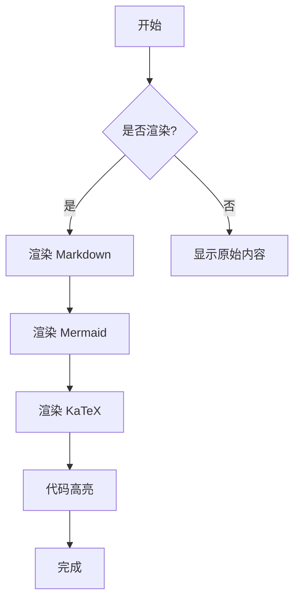
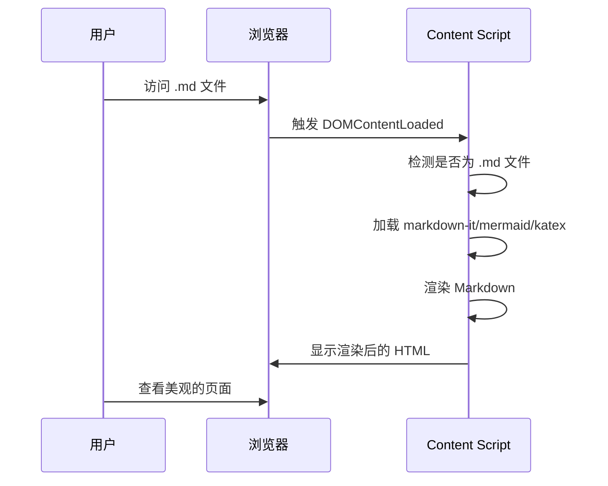
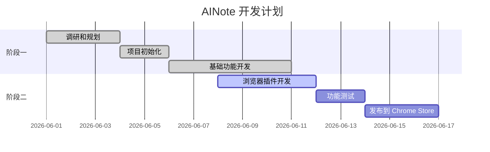
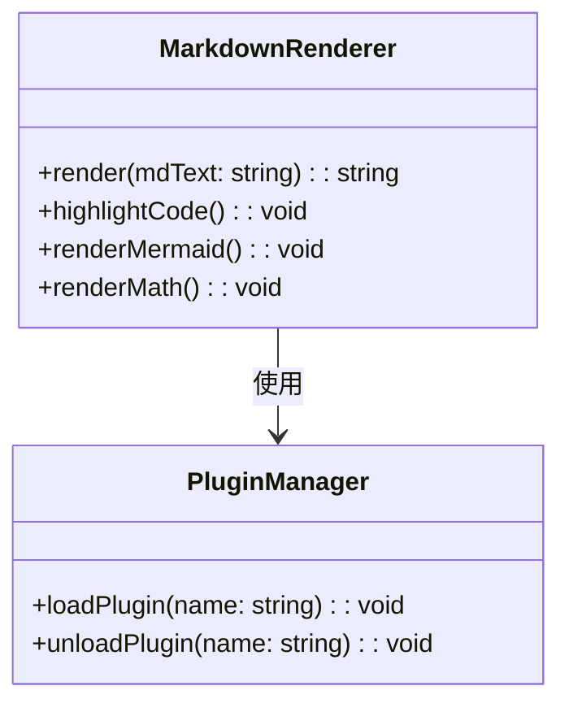
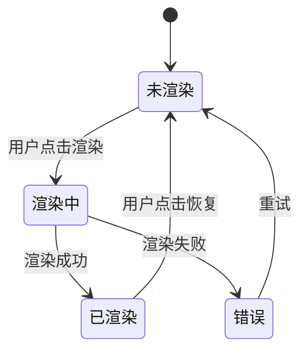

# AINote 浏览器插件 - 功能测试文档

本文档用于测试 AINote 浏览器插件的各项功能。

## 1. 基础 Markdown 渲染

### 1.1 标题

# H1 标题

## H2 标题

### H3 标题

#### H4 标题

##### H5 标题

###### H6 标题

### 1.2 段落和文本样式

这是一段普通文本。**粗体文本**、*斜体文本*、~~删除线文本~~、`行内代码`。

组合样式：**粗体+斜体**、***粗体+斜体+删除线***。

### 1.3 列表

**无序列表**:
- 项目 1
- 项目 2
  - 子项目 2.1
  - 子项目 2.2
- 项目 3

**有序列表**:
1. 第一项
2. 第二项
3. 第三项

**任务列表**:
- [x] 已完成的任务
- [ ] 未完成的任务
- [ ] 另一个未完成的任务

### 1.4 链接和图片

[GitHub](https://github.com)


### 1.5 引用

> 这是一段引用文本。
> 可以跨多行。
>
> - 甚至包含列表

### 1.6 水平线

---

## 2. 代码块高亮

### 2.1 JavaScript

```javascript
function hello(name) {
  console.log(`Hello, ${name}!`);
  return { success: true };
}

hello('World');
```

### 2.2 Python

```python
def fibonacci(n):
    if n <= 1:
        return n
    return fibonacci(n-1) + fibonacci(n-2)

print([fibonacci(i) for i in range(10)])
```

### 2.3 CSS

```css
.ainote-rendered {
  max-width: 900px;
  margin: 0 auto;
  padding: 32px;
  font-size: 16px;
  line-height: 1.6;
}
```

### 2.4 HTML

```html
<!DOCTYPE html>
<html lang="zh-CN">
<head>
  <meta charset="UTF-8">
  <title>测试页面</title>
</head>
<body>
  <h1>Hello World</h1>
</body>
</html>
```

### 2.5 JSON

```json
{
  "name": "ainote",
  "version": "1.0.0",
  "description": "Markdown 渲染器"
}
```

### 2.6 Bash

```bash
# 安装依赖
npm install

# 启动开发服务器
npm run dev

# 构建生产版本
npm run build
```

## 3. Mermaid 图表

### 3.1 流程图



### 3.2 时序图



### 3.3 甘特图



### 3.4 类图



### 3.5 状态图



## 4. KaTeX 数学公式

### 4.1 行内公式

爱因斯坦的质能方程 $E = mc^2$ 是物理学中最著名的公式之一。

勾股定理 $a^2 + b^2 = c^2$ 适用于直角三角形。

欧拉公式 $e^{i\pi} + 1 = 0$ 被称为"数学中最美的公式"。

### 4.2 块级公式

麦克斯韦方程组：

$$
\nabla \cdot \mathbf{E} = \frac{\rho}{\varepsilon_0}
$$

$$
\nabla \cdot \mathbf{B} = 0
$$

$$
\nabla \times \mathbf{E} = -\frac{\partial \mathbf{B}}{\partial t}
$$

$$
\nabla \times \mathbf{B} = \mu_0\mathbf{J} + \mu_0\varepsilon_0\frac{\partial \mathbf{E}}{\partial t}
$$

薛定谔方程：

$$
i\hbar\frac{\partial}{\partial t}\Psi(\mathbf{r},t) = \left[-\frac{\hbar^2}{2m}\nabla^2 + V(\mathbf{r},t)\right]\Psi(\mathbf{r},t)
$$

### 4.3 矩阵

矩阵表示：

$$
\mathbf{A} = \begin{pmatrix}
a_{11} & a_{12} & \cdots & a_{1n} \\
a_{21} & a_{22} & \cdots & a_{2n} \\
\vdots & \vdots & \ddots & \vdots \\
a_{m1} & a_{m2} & \cdots & a_{mn}
\end{pmatrix}
$$

## 5. 表格

### 5.1 简单表格

| 功能 | 状态 | 备注 |
|------|------|------|
| Markdown 渲染 | ✅ | 使用 markdown-it |
| Mermaid 图表 | ✅ | 需要 CDN 加载 |
| KaTeX 公式 | ✅ | 支持行内和块级 |
| 代码高亮 | ✅ | 使用 Highlight.js |
| 主题切换 | ✅ | 亮色/暗色/跟随系统 |
| 浮动按钮 | ✅ | 页面右下角 |

### 5.2 对齐表格

| 左对齐 | 居中对齐 | 右对齐 |
| :------ | :------: | ------: |
| 内容 A | 内容 B | 内容 C |
| 内容 D | 内容 E | 内容 F |

## 6. 高级 Markdown 特性

### 6.1 定义列表

术语 A
: 定义 A

术语 B
: 定义 B1
: 定义 B2

### 6.2 脚注

这里有一个脚注引用[^1]。

这是另一个脚注引用[^2]。

[^1]: 这是第一个脚注的内容。
[^2]: 这是第二个脚注的内容。

### 6.3 缩写

HTML 是超文本标记语言的缩写。

*[HTML]: Hyper Text Markup Language

### 6.4 上下标

H~2~O 是水的化学式。

X^2^ + Y^2^ = Z^2^

## 7. 测试说明

### 7.1 预期效果

1. **基础渲染**: 所有 Markdown 元素应正确渲染（标题、段落、列表、链接、图片、引用、表格等）
2. **代码高亮**: 代码块应根据语言显示语法高亮
3. **Mermaid 图表**: Mermaid 代码块应渲染为美观的图表（流程图、时序图、甘特图等）
4. **KaTeX 公式**: 行内公式和块级公式应渲染为美观的数学符号
5. **主题切换**: 切换主题时，页面样式应即时更新

### 7.2 测试方法

1. 将本文件上传到 GitHub 仓库（如 `test-ainote.md`）
2. 访问该文件的 raw 页面（如 `https://raw.githubusercontent.com/.../test-ainote.md`）
3. 插件应自动渲染该文件
4. 检查各项功能是否正常

### 7.3 已知问题

1. **CDN 加载失败**: 如果网络不通，Mermaid/KaTeX/Highlight.js 可能无法加载
2. **公式解析错误**: 复杂的 LaTeX 公式可能无法正确渲染
3. **Mermaid 语法错误**: 如果 Mermaid 代码有语法错误，图表将无法渲染

## 8. 总结

如果所有测试都通过，说明 AINote 浏览器插件的核心功能已经正常工作！🎉

可以进一步添加更多功能，如：
- 导出为 PDF
- 编辑器模式
- 更多主题
- 自定义 CSS
- 快捷键支持
