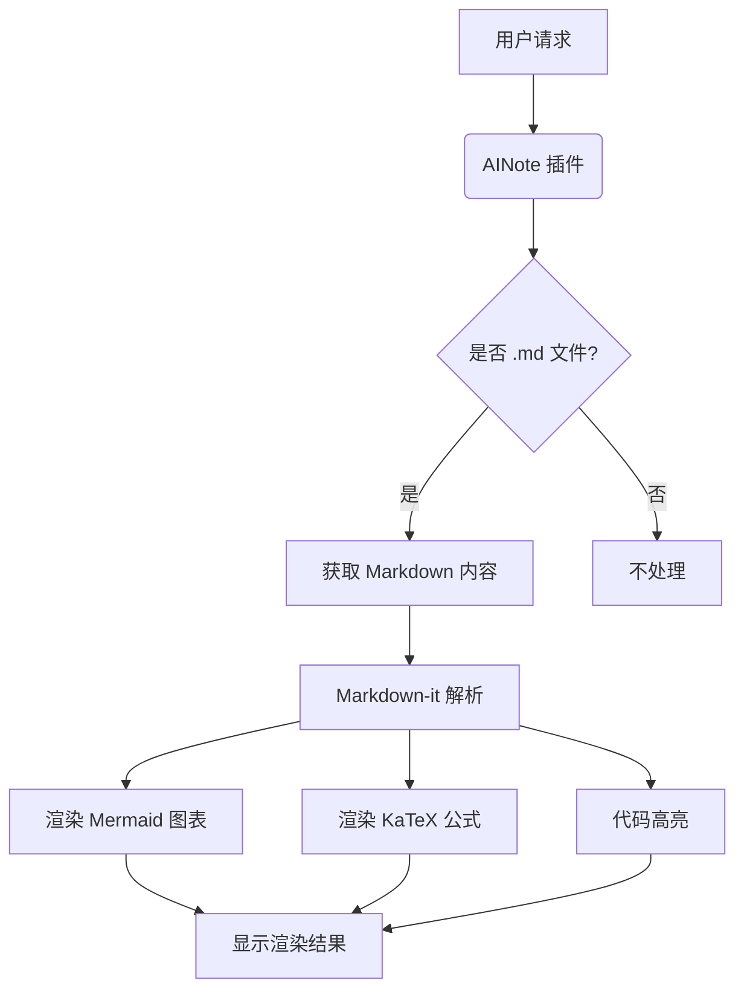
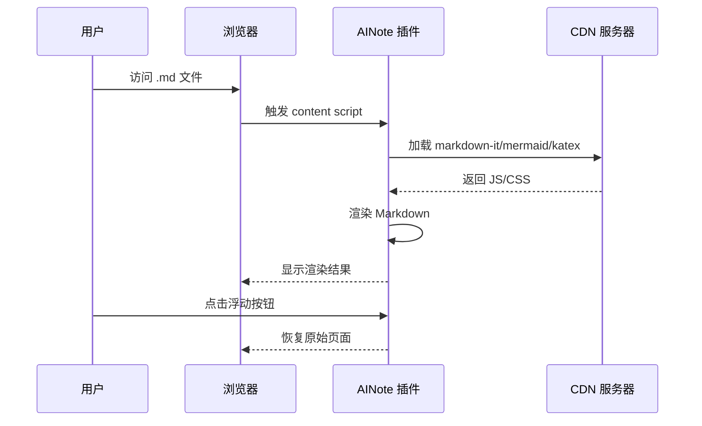
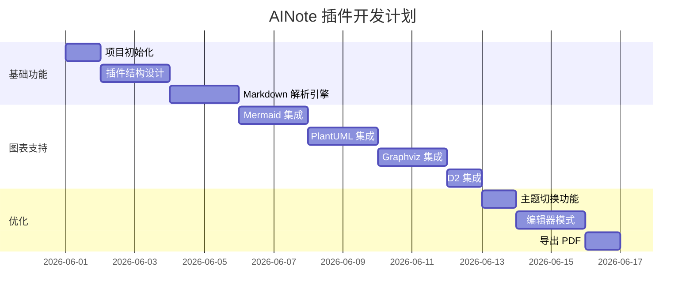
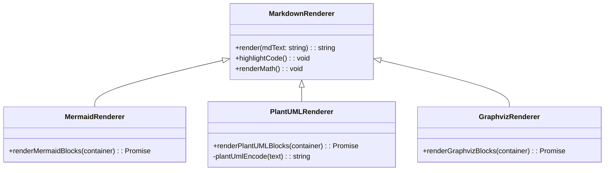
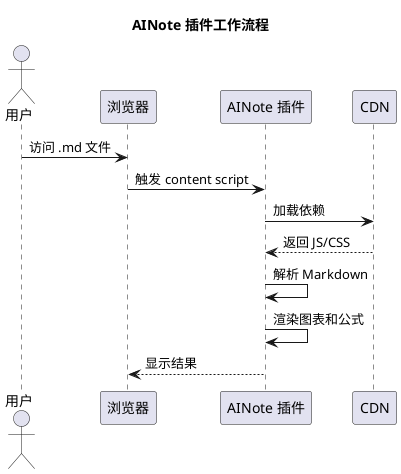
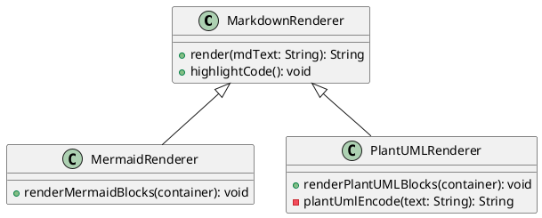
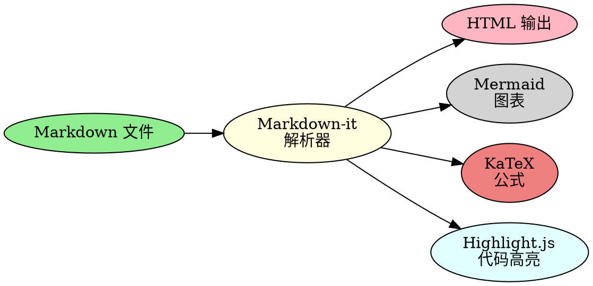

# AINote 架构图渲染测试

本文件用于测试 AINote 浏览器插件对各种 AI 生成架构图格式的支持。

---

## 1. Mermaid 流程图



## 2. Mermaid 时序图



## 3. Mermaid 甘特图



## 4. Mermaid 类图



## 5. PlantUML 时序图



## 6. PlantUML 类图



## 7. Graphviz DOT 图（系统架构）

```dot
digraph system_architecture {
    rankdir=TB;
    node [shape=box, style=filled, fillcolor=lightblue];

    client [label="浏览器客户端", fillcolor=lightgreen];
    extension [label="AINote\n浏览器插件", fillcolor=lightyellow];
    cdn [label="CDN\n(markdown-it/mermaid/katex)", fillcolor=lightpink];
    github [label="GitHub\n原始 .md 文件", fillcolor=lightgrey];

    client -> extension [label="访问 .md 文件"];
    extension -> cdn [label="加载依赖"];
    extension -> github [label="获取原始内容"];
    extension -> extension [label="解析并渲染"];
    client <- extension [label="显示渲染结果"];
}
```

## 8. Graphviz DOT 图（数据流）



## 9. D2 图（插件架构）

```d2
title: AINote 浏览器插件架构

chrome_extension: {
  label: "Chrome 扩展"
  shape: rectangle

  manifest: {
    label: "manifest.json\n(Manifest V3)"
    shape: rectangle
  }

  popup: {
    label: "popup.html/js\n(设置面板)"
    shape: rectangle
  }

  background: {
    label: "background.js\n(后台脚本)"
    shape: rectangle
  }

  content: {
    label: "content.js\n(内容脚本)"
    shape: rectangle

    parsers: {
      markdown_it: "Markdown-it"
      mermaid: "Mermaid"
      plantuml: "PlantUML"
      graphviz: "Graphviz"
      katex: "KaTeX"
      highlightjs: "Highlight.js"
    }
  }
}

user: {
  label: "用户"
  shape: person
}

user -> popup: "打开设置"
user -> content: "访问 .md 文件"
content -> parsers: "渲染内容"
parsers -> user: "显示结果"
```

## 10. 直接嵌入 SVG

以下是直接嵌入的 SVG 图形（AI 有时会自动生成 SVG 代码）：

<svg xmlns="http://www.w3.org/2000/svg" width="400" height="200" viewBox="0 0 400 200">
  <rect x="10" y="10" width="380" height="180" fill="#f0f0f0" stroke="#333" stroke-width="2" rx="10"/>
  <circle cx="100" cy="100" r="40" fill="#4caf50" opacity="0.7"/>
  <rect x="200" y="60" width="80" height="80" fill="#2196f3" opacity="0.7"/>
  <polygon points="320,140 280,140 300,60" fill="#ff9800" opacity="0.7"/>
  <text x="200" y="190" text-anchor="middle" font-family="Arial" font-size="14">嵌入式 SVG 测试</text>
</svg>

---

## 11. 测试说明

### 预期效果

| 格式 | 预期渲染结果 |
|------|--------------|
| Mermaid | 显示为交互式 SVG 图表 |
| PlantUML | 显示为来自官方服务器的 SVG 图片 |
| Graphviz DOT | 显示为 SVG 图表（使用 viz.js 在浏览器端渲染） |
| D2 | 显示为来自官方服务器的 SVG 图片（可能受 CORS 限制） |
| 直接嵌入 SVG | 直接显示为 SVG 图形 |

### 测试方法

1. 将本文件上传到 GitHub 仓库（`openpeng/ainote`）
2. 获取 raw 文件链接（`https://raw.githubusercontent.com/...`）
3. 在浏览器中打开该链接
4. AINote 插件应自动渲染本文件
5. 检查各种图表是否正确显示

### 问题排查

- **Mermaid 不显示**：检查浏览器控制台是否有 `mermaid.render()` 错误
- **PlantUML 不显示**：检查网络请求是否成功（`https://www.plantuml.com/...`）
- **Graphviz 不显示**：检查 `viz.js` 是否加载成功
- **D2 不显示**：可能是 CORS 问题，检查网络请求是否被阻止
- **SVG 不显示**：检查 SVG 代码是否完整，是否有语法错误
